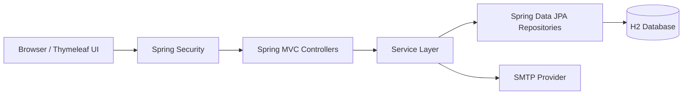

<div align="center">

# AuraTechStores

### A secure, role-based electronics storefront and inventory management system built with Spring Boot.

[](https://github.com/tarekkalsayed-pixel/AuraTechStores/actions/workflows/ci.yml)


**Spring MVC · Spring Security · Spring Data JPA · Thymeleaf · H2 · SMTP · Maven**

</div>

---

## Overview

AuraTechStores is a full-stack electronics retail demo for managing and browsing products across multiple branches.

The application separates public browsing, authenticated customer functionality, and administrator operations through Spring Security roles. Administrators can manage inventory, pricing, discounts, branch stock, customer offer emails, and an operations audit trail, while customers get a protected account area and product catalog.

The repository is designed as a portfolio project that demonstrates more than basic CRUD: it includes authentication and authorization, validation, persistent data, SMTP integration, audit logging, environment-based secret configuration, CSRF protection, and automated Maven verification through GitHub Actions.

## Highlights

| Area | Capability |
|---|---|
| **Public Storefront** | Browse products, pricing, categories, branch availability, stock, and discounts |
| **Authentication** | Registration and custom Spring Security login flow |
| **Authorization** | Separate `USER` and `ADMIN` protected areas |
| **Inventory Management** | Admin add, edit, and delete operations for products |
| **Branch Stock** | Track product inventory by branch |
| **Discounts** | Percentage discounts with calculated discounted pricing |
| **Offer Emails** | Send product offers through configurable SMTP integration |
| **Audit History** | Record registration, product changes, deletions, and offer-email activity |
| **Persistent Storage** | File-backed H2 database for local development |
| **Security** | BCrypt-backed password storage for new accounts, CSRF protection, POST-only destructive actions, environment-based credentials |
| **CI** | GitHub Actions runs Maven verification on pushes and pull requests |

## Architecture



### Application Layers

```text
src/main/java/org/example/
├── config/       Security configuration and seed data
├── controller/   HTTP request handling
├── model/        JPA entities and validation
├── repository/   Database access
└── service/      Application/business logic
```

The frontend lives under:

```text
src/main/resources/
├── static/       CSS, JavaScript, and product images
├── templates/    Thymeleaf pages
└── application.properties
```

## Security Design

AuraTechStores includes several security improvements intended to make the project representative of good application-development practice:

- Role-based route protection with Spring Security
- BCrypt-backed password encoding for newly created accounts
- Compatibility handling for older local demo databases
- CSRF protection for application forms
- H2 console excluded from CSRF only for local development
- Destructive product deletion uses `POST`, not `GET`
- SMTP passwords and database credentials are read from environment variables
- `.env`, local database files, logs, and IDE metadata are excluded from Git
- A dedicated [`SECURITY.md`](SECURITY.md) documents security expectations

> **Important:** local demo accounts are intentionally simple and must never be reused as production credentials.

## Roles & User Flow

### Customer

```text
Public Catalog
     ↓
Registration / Login
     ↓
Authenticated User Home
     ↓
Browse Products + Branch Stock + Discounts
     ↓
Profile
```

### Administrator

```text
Login
  ↓
Admin Dashboard
  ├── Add Product
  ├── Edit Product
  ├── Delete Product
  ├── Manage Stock / Branch / Discounts
  ├── Send Offer Email
  └── Review Operations History
```

## Tech Stack

| Layer | Technology |
|---|---|
| Language | Java 17 |
| Framework | Spring Boot 4 |
| Web | Spring MVC |
| Security | Spring Security |
| Persistence | Spring Data JPA |
| Templates | Thymeleaf |
| Database | H2 file database |
| Validation | Jakarta Validation |
| Email | Spring Mail / SMTP |
| Build | Maven |
| CI | GitHub Actions |

## Local Demo Accounts

The project seeds two accounts for **local demonstration only**:

| Role | Username | Password |
|---|---|---|
| Admin | `admin` | `12345` |
| User | `user` | `12345` |

These credentials exist to make a classroom/portfolio demo quick to run. Do **not** use them in a public deployment.

## Running Locally

### Requirements

- Java 17
- Maven, or Maven support through IntelliJ IDEA

### Start the application

```bash
mvn spring-boot:run
```

Or run `Application.java` from IntelliJ IDEA.

Then open:

```text
http://localhost:8086
```

The application uses a file-backed H2 database by default:

```text
./data/aura
```

## Environment Configuration

The repository contains [`.env.example`](.env.example) as a reference for supported configuration values.

Common environment variables:

```text
PORT
DB_URL
DB_DRIVER
DB_USERNAME
DB_PASSWORD
JPA_DDL_AUTO
JPA_SHOW_SQL
H2_CONSOLE_ENABLED
THYMELEAF_CACHE
MAIL_HOST
MAIL_PORT
MAIL_USERNAME
MAIL_PASSWORD
MAIL_SMTP_AUTH
MAIL_STARTTLS_ENABLE
```

### SMTP

Offer-email functionality requires valid SMTP credentials.

For Gmail, use an app password rather than your main Google account password and provide it through `MAIL_PASSWORD`.

**Never commit real SMTP credentials to Git.**

## Continuous Integration

Every push and pull request to `main` runs:

```bash
mvn --batch-mode --no-transfer-progress verify
```

The workflow is defined in:

```text
.github/workflows/ci.yml
```

## Database Reference

A simplified database schema reference is available in:

[`docs/database_schema.sql`](docs/database_schema.sql)

The main domain entities are:

- `User`
- `Product`
- `OperationHistory`

## Current Scope

AuraTechStores is a portfolio/educational storefront, not a production commerce platform.

Current intentional limitations include:

- H2 is the default local database
- No payment processing
- No checkout/order lifecycle
- SMTP delivery depends on external mail configuration
- Demo seed accounts are intended for local use only

These boundaries are documented so the repository clearly distinguishes implemented features from future production work.

## Potential Next Steps

- PostgreSQL production profile
- Automated controller/service tests
- Docker support
- Product search and filtering
- Customer cart and order lifecycle
- Pagination for large catalogs
- Deployment configuration

---

<div align="center">

### Built by Tarek Elsayed

**Computer Science · Java · Spring Boot · Full-Stack Development**

[GitHub Profile](https://github.com/tarekkalsayed-pixel)

</div>
